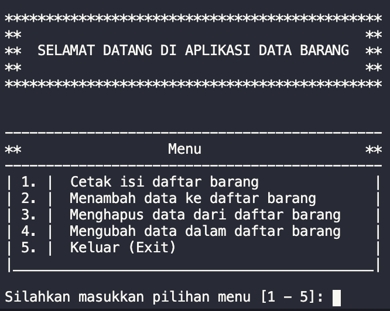

## My Purwadhika Journey

### Homework: 
  1. pr-1: Variable and Mathematic Operations
  2. pr-2: Conditional (IF-ELIF-ELSE)
  3. pr-3: List Slicing, Palindrome, List Indexing, Try-Except
  4. pr-4: Set(Union, Intersection, Difference)
  5. pr-5: Looping Pattern
  6. pr-6: String Reverse
  7. pr-7: Email Validation
  8. pr-8: 
      - <b>a. kalkulator()</b>
        > kalkulator (+, -, /, *) 
        > <b>inputan:</b> 
        > inputan angka 1 : 8 
        > inputan angka 2 : 10 
        > masukkan operator: +  
        > <b>output</b>: hasil penjumlahan 8 + 10 = 18  
      - <b>b. kodemorse()</b>
        > Translator (Encoder-Decoder Kode Morse) 
        > Silakan masukkan kalimat: Anda 
        > <b>Outputnya</b> : (kode morse nya) * - / - - / * - / - * 
        > Silakan masukkan kalimat : . - / - - / . - / - . 
        > <b>Outputnya</b> : Aman 
        > kode morse dictionary: wikipedia 
      - <b>c. fizzbuzz()</b>
        > <b>input</b> masukkan angka : 
        > <b>outputnya</b> 
        > angka yang habis bisa dibagi 3 : Fizz 
        > angka yang habis bisa dibagi 5 : Buzz  
        > angka yang habis dibagi 3 dan dibagi 5 : Fizz Buzz  
        > 1 
        > 2 
        > Fizz 
        > 4 
        > Buzz 
        > Fizz 
        > 7 
        > 8 
        > Fizz 
        > Buzz 
        > 11 
      - <b>d. caesar_chiper()</b>
        > masukkan kata: Joni  
        > masukkan angka : 2 
        > hasil caesar cipher : lnpk 
        > masukkan kata : Joni  
        > masukkan angka : -2 
        > hasil caesar cipher: imlg 
      - e. <b>romawi()</b>
        > Batas maksimal 4000 
        > keluar notif : angka diluar jangkauan 
        > Translator (Encoder-Decoder Angka Romawi) 
        > silakan masukkan angka: 2018 
        > outputnya: (angka romawinya) MMXVIII 
        > silakan masukkan kalimat: MMXVIII 
        > output: 2018 
        > CCLXXVIII: 278 
        > MMMCMXCII. 
      - f. <b>konversi_angka()</b>
        > konversi angka digital 
        > masukkan angka: 9 

  9. pr-9: ascdesc(pilihan, lst), minmaks(lst), stats(lst), rotasi(x)
  10. pr-10: Reduce

### Coding Challenge 
segitiga_kata.py
  > print(segitigaKata('kode python')) 
  > k 
  > o d 
  > e p y 
  > t h o n 
  > k o d e 
  > p y t 
  > h o 
  > n 

### Group Assignment 
  1. toko_buah_crud.py
    
  2. tugaskelompok2.py
